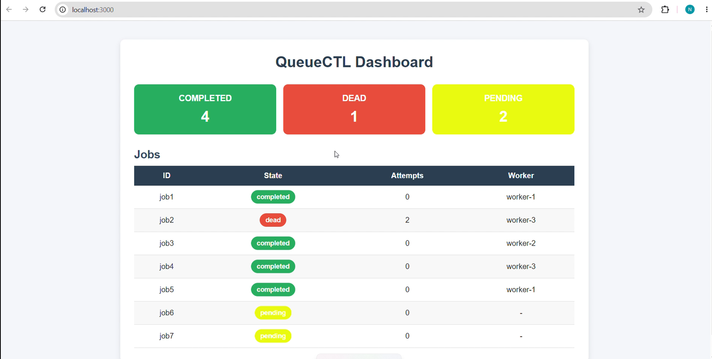

# QueueCTL

A CLI-based background job queue system built with Node.js. It manages background
jobs using multiple worker processes, automatically retries failed jobs with
exponential backoff, and moves permanently failed jobs into a Dead Letter Queue (DLQ).
It also includes a simple web dashboard for visual monitoring.

Built for: **QueueCTL - Backend Developer Internship Assignment**

Demo video: [Watch here](https://drive.google.com/file/d/1I5dhd5Nukq20cGgzCaEm4bh7KDdnfIeE/view?usp=drive_link)

---

## Table of Contents

- [Screenshots](#screenshots)
- [Tech Stack](#tech-stack)
- [Setup Instructions](#setup-instructions)
- [Usage Examples](#usage-examples)
- [Job Specification](#job-specification)
- [Architecture Overview](#architecture-overview)
- [Bonus Feature: Web Dashboard](#bonus-feature-web-dashboard)
- [Assumptions & Trade-offs](#assumptions--trade-offs)
- [Testing Instructions](#testing-instructions)
- [Known Limitations](#known-limitations)
- [Project Structure](#project-structure)
- [AI Usage Note](#ai-usage-note)

---

## Screenshots

### Web Dashboard


---

## Tech Stack

| Layer | Choice | Why |
|---|---|---|
| Language | Node.js | CLI-friendly, async-capable, easy to demo |
| CLI framework | [`commander`](https://www.npmjs.com/package/commander) | Simple, well-documented subcommand parsing |
| Storage | [`better-sqlite3`](https://www.npmjs.com/package/better-sqlite3) | Synchronous SQLite driver — real ACID transactions for locking, no external DB server needed |
| Process model | Node's built-in `child_process` (`fork`, `spawn`) | Each worker is a real OS process, and each job's shell command runs as its own child process |
| Dashboard (bonus) | [`express`](https://www.npmjs.com/package/express) + HTML/CSS/JS | Lightweight way to serve a monitoring UI on top of the same SQLite data |

No Redis, no Postgres, no external services — everything runs off a single
SQLite file (`queuectl.db`) that is created automatically on first run.

---

## Setup Instructions

**Requirements:** Node.js v18 or newer.

```bash
git clone <your-repo-url>
cd queuectl
npm install
```

That's it. The first time any command runs, `queuectl.db` (SQLite) is created
automatically in the project folder — no manual database setup required.

> **Windows PowerShell users:** PowerShell 5.1 has a known bug where it mangles
> double quotes when passing arguments to external programs like `node.exe`.
> Use the `--%` stop-parsing operator if you hit JSON parse errors:
> ```powershell
> node bin/queuectl.js enqueue --% "{\"id\":\"job1\",\"command\":\"echo hi\"}"
> ```

---

## Usage Examples

### Enqueue a job

```bash
node bin/queuectl.js enqueue '{"id":"job1","command":"echo Hello World"}'
```
```
enqueued job 'job1' (state=pending)
```

Optional fields: `max_retries` (defaults to the `max-retries` config value).

```bash
node bin/queuectl.js enqueue '{"id":"job2","command":"exit 1","max_retries":3}'
```

### Start workers

```bash
node bin/queuectl.js worker start --count 3
```
```
Starting 3 worker(s)... (Ctrl+C to stop)
[worker-1] Worker started (pid: 12048)
[worker-1] Picked up job "job1" -> echo Hello World
[worker-1] Job "job1" completed successfully.
[worker-2] Picked up job "job2" -> exit 1
[worker-2] Job "job2" failed. Will retry at 2026-07-17T09:01:04.000Z.
```

Stop them gracefully from another terminal:

```bash
node bin/queuectl.js worker stop
```
```
Stop signal sent. Workers will finish current job and exit.
```

Each worker finishes whatever job it is currently running before it exits —
no job is ever killed mid-execution.

### Check status

```bash
node bin/queuectl.js status
```
```
Queue Summary
┌─────────┬───────────┬───────┐
│ (index) │   state   │ count │
├─────────┼───────────┼───────┤
│    0    │ 'pending' │   1   │
│    1    │'completed'│   4   │
│    2    │  'dead'   │   1   │
└─────────┴───────────┴───────┘
```

```bash
node bin/queuectl.js status job1
```
Shows the full row for a single job (state, attempts, timestamps, output, etc.)

### List jobs

```bash
node bin/queuectl.js list
node bin/queuectl.js list --state pending
node bin/queuectl.js list --state dead
```

### Dead Letter Queue

```bash
node bin/queuectl.js dlq list
node bin/queuectl.js dlq retry job2
```
```
Job 'job2' moved back to pending.
```

### Configuration

```bash
node bin/queuectl.js config set max-retries 5
node bin/queuectl.js config set backoff-base 3
node bin/queuectl.js config get
```
```
max-retries = 5
backoff-base = 3
```

---

## Job Specification

Every job stored in the `jobs` table has:

| Field | Type | Notes |
|---|---|---|
| `id` | string | Unique. Auto-generated (UUID) if not supplied. |
| `command` | string | Any shell command, run via `child_process.spawn(command, { shell: true })`. |
| `state` | string | `pending` → `processing` → `completed` / `failed` / `dead`. |
| `attempts` | integer | Number of times the job has been tried. |
| `max_retries` | integer | Attempts allowed before the job moves to the DLQ. Defaults to the `max-retries` config value. |
| `created_at` / `updated_at` | ISO timestamp | Bookkeeping. |
| `next_run_at` | ISO timestamp | Set after a failure — the job won't be claimed again until this time (backoff window). |
| `worker_id` | string | Which worker currently owns / last owned the job. |
| `last_error` | string | Captured error / non-zero exit reason from the last failed attempt. |
| `output` | string | Captured stdout from the last run. |

---

## Architecture Overview

### Job Lifecycle

```
enqueue
   │
   ▼
[pending] ───────────────────────────┐
   │                                  │
worker claims it (locked, atomic)     │ retry after backoff delay
   │                                  │  (attempts < max_retries)
   ▼                                  │
[processing]                          │
   │            \                     │
exit code 0     exit code != 0 ───────┘
   │             or command not found
   ▼
[completed]        (if attempts >= max_retries)
                          │
                          ▼
                       [dead]   <-- Dead Letter Queue
```

### Persistence

All state lives in a single SQLite file (`queuectl.db`) via `better-sqlite3`.
Because SQLite writes to disk, jobs, their attempt counts, and their states
survive a full process restart — closing and reopening the database (i.e.
running the CLI again) picks up exactly where things left off.

### Concurrency & Locking (the important part)

The hardest requirement in this assignment is making sure two workers never
process the same job. This is solved with SQLite's transaction locking rather
than an external lock file or Redis:

```js
const claimJob = db.transaction((workerId) => {
  const job = db.prepare(`SELECT ... WHERE state='pending' ... LIMIT 1`).get();
  if (!job) return null;

  const result = db.prepare(
    `UPDATE jobs SET state='processing', worker_id=? WHERE id=? AND state='pending'`
  ).run(workerId, job.id);

  if (result.changes === 0) return null; // someone else got it
  return getJob(job.id);
});

// called as claimJob.immediate(workerId)
```

Calling this with `.immediate()` makes SQLite acquire a write lock on the
whole database the moment the transaction starts (`BEGIN IMMEDIATE`). If two
worker processes call `claimJob.immediate()` at the same second, the second
one is forced to wait until the first one's transaction commits — so the
"find a pending job" and "mark it processing" steps behave as one atomic,
uninterruptible unit. The `WHERE ... AND state='pending'` clause on the
`UPDATE` is a second safety net: if `changes === 0`, some other process
already claimed it, and this worker simply loops back and asks again.

`db.pragma('busy_timeout = 5000')` is also set, so if a worker does have to
wait for a lock, it retries quietly for up to 5 seconds instead of throwing
an immediate `SQLITE_BUSY` error.

### Worker Model

Each worker started by `worker start --count N` is a **separate OS process**,
created with Node's `child_process.fork()` — not a thread. This means one
job hanging or crashing can never take down another worker.

Each worker runs an infinite loop:

```
claim a job → execute its command → success? mark completed
                                   → failure? mark failed (retry or DLQ)
             → repeat
```

The command itself is executed as its own child process via
`child_process.spawn(command, { shell: true })`, and its exit code decides
success (`0`) vs. failure (anything else, including "command not found").

### Graceful Shutdown

Two independent mechanisms both let the currently running job finish before
a worker exits:

1. **Ctrl+C** in the terminal running `worker start` — a `SIGINT`/`SIGTERM`
   handler sets a local flag that's checked between jobs.
2. **`queuectl worker stop`** from a different terminal — this simply writes
   a row into a small `control` table (`stop = 'true'`). Every running worker
   polls this table on each loop iteration and exits cleanly once it sees it.
   `worker start` clears this flag automatically so a fresh run never
   inherits a stale stop signal.

### Retry & Exponential Backoff

On failure:

```
attempts += 1
if (attempts >= max_retries) {
  state = 'dead'                      // -> DLQ
} else {
  delay = backoff_base ** attempts    // seconds
  next_run_at = now + delay
  state = 'pending'
}
```

With the default `backoff_base = 2`:

| Failure # | Delay before next try |
|---|---|
| 1st | 2¹ = 2s |
| 2nd | 2² = 4s |
| 3rd (if `max_retries=3`) | job moves to `dead` instead |

`next_run_at` is just a column checked in `claimJob`'s `WHERE` clause — no
separate timer or scheduler thread is needed. The same polling loop that
picks up new jobs also naturally picks up jobs whose backoff window has
elapsed.

### Configuration

`max-retries` and `backoff-base` are stored in a `config` key/value table
(instead of being hardcoded), so they persist across restarts and can be
changed live with `queuectl config set ...` without touching the code.

---

## Bonus Feature: Web Dashboard

A simple monitoring dashboard built with **Express** + HTML/CSS/JS, for
visually viewing job states without using the CLI. It reads from the same
`queuectl.db` SQLite file used by the CLI and workers, so it always reflects
live data.

### Running the dashboard

```bash
npm install
node <YOUR_SERVER_FILE_NAME>.js
```

Then open your browser at:

```
http://localhost:<YOUR_PORT_NUMBER>
```

### What it shows

- Current job counts grouped by state (pending / processing / completed / dead)
- Full job list with state, attempts, and timestamps
- Dead Letter Queue view

> **Note:** The dashboard is read-only monitoring — all job management
> (enqueue, retry, config) is still done through the `queuectl` CLI.

---

## Assumptions & Trade-offs

- **Single-machine scope.** Everything (CLI, workers, database, dashboard)
  runs on one host against one SQLite file, matching the "CLI-based" nature
  of the assignment. All persistence logic is isolated in `db.js`, so
  swapping SQLite for Postgres/Redis later would only require changing that
  one file.
- **Commands run via `shell: true`.** This keeps job specs simple (supports
  `&&`, pipes, etc.), at the cost of trusting whoever is allowed to enqueue
  jobs — acceptable for a single-user CLI tool, not for a multi-tenant system.
- **Polling, not push notifications.** Workers poll the database every second
  when idle rather than being notified instantly. Simple and reliable; the
  trade-off is up to ~1 second of latency before a new job is picked up.
- **`worker start` runs in the foreground.** This keeps the demo and the
  Ctrl+C behaviour visible and easy to reason about. For a real always-on
  deployment you'd wrap it with something like `pm2` or a systemd service.
- **Output is stored per job, not streamed.** `stdout`/`stderr` are captured
  after the command finishes and saved on the job row (visible via
  `queuectl status <id>`), rather than streamed live to the terminal.
- **Dashboard is read-only.** It was added as a bonus for visibility, not to
  replace the CLI as the primary interface.

---

## Testing Instructions

Manual end-to-end flow (two terminals):

**Terminal 1:**
```bash
node bin/queuectl.js worker start --count 2
```

**Terminal 2:**
```bash
# a job that succeeds
node bin/queuectl.js enqueue '{"id":"ok1","command":"echo it works"}'

# a job that always fails -> watch it retry with backoff, then hit the DLQ
node bin/queuectl.js enqueue '{"id":"bad1","command":"exit 1","max_retries":2}'

# an invalid command -> fails gracefully, does not crash the worker
node bin/queuectl.js enqueue '{"id":"bad2","command":"not_a_real_command_xyz"}'

node bin/queuectl.js status
node bin/queuectl.js dlq list
node bin/queuectl.js dlq retry bad1
node bin/queuectl.js worker stop
```

**Persistence check:** stop all workers, close the terminal, run
`node bin/queuectl.js list` again later — completed/pending/dead jobs are
all still there because they live in `queuectl.db` on disk, not in memory.

**Concurrency check:** start `worker start --count 3` and enqueue 5–6 jobs at
once (a small loop of `enqueue` calls). Watch `status`/`list` — no job is
ever picked up by two workers at the same time, and no job is skipped.

---

## Known Limitations

- No automated test suite yet (manual testing only, as documented above).
- No job timeout handling, priority queues, or scheduled (`run_at`) jobs.
- Dashboard is monitoring-only; no actions (retry/enqueue) from the UI yet.
- Tested primarily on Windows (PowerShell); shell command syntax used in job
  `command` fields should be written for the OS the workers run on.

---

## Project Structure

```
queuectl/
├── bin/
│   └── queuectl.js       # CLI entry point (all commands wired up here)
├── src/
│   ├── db.js              # SQLite schema + all persistence/locking logic
│   ├── worker.js          # startWorker() — the poll/claim/execute/retry loop
│   └── worker-runner.js   # tiny bootstrap file used by fork() to launch a worker
├── <dashboard files/folder here>   # Express server + HTML/CSS/JS for the dashboard
├── queuectl.db            # created automatically on first run (gitignored)
├── package.json
└── README.md
```

---

